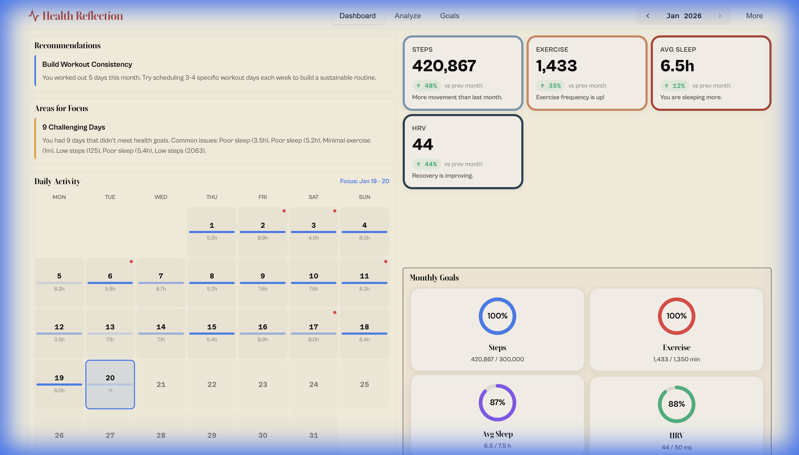
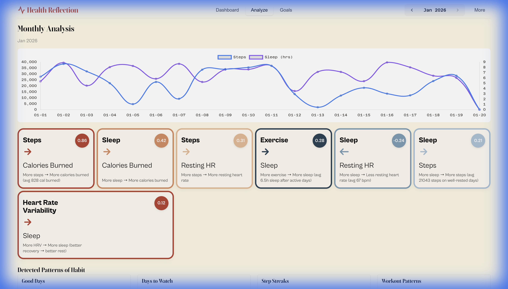
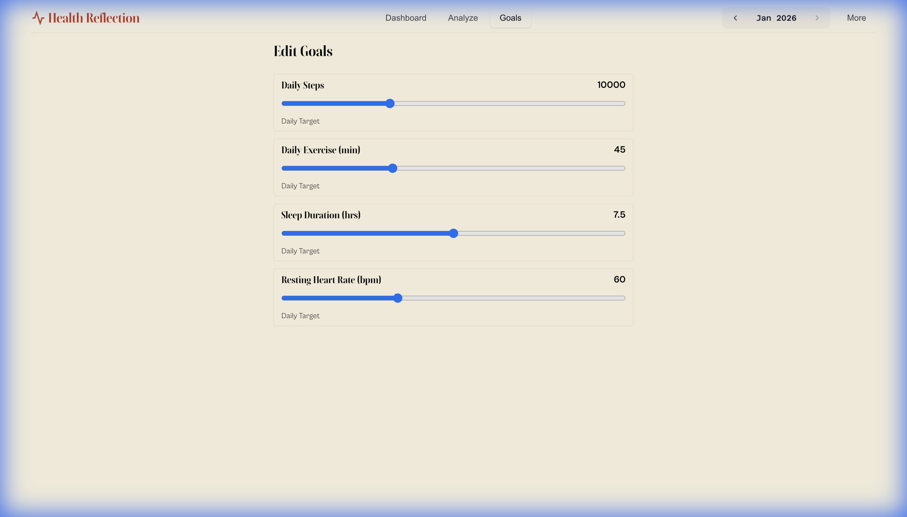

# Personal Data Reflection Tool

A comprehensive visualization and reflection tool for analyzing personal health and fitness data from multiple sources.

## Overview

This tool consolidates data from Apple Health and Strava into a unified DuckDB database, providing:

- **Monthly Review Dashboard**: Interactive visualizations of your health and fitness data
- **Correlation Analysis**: Discover connections between different metrics (e.g., sleep quality vs. workout performance)
- **Pattern Detection**: Identify trends, clusters, and anomalies in your behavior
- **Reflection Reports**: Monthly summaries with insights and suggested behavior changes

## Features

### Data Sources
- **Apple Health**: Steps, heart rate, sleep, workouts, energy burned, etc.
- **Strava**: Activities (runs, rides, walks) with detailed metrics and streams

### Analysis Capabilities
- Daily/weekly/monthly aggregates
- Cross-metric correlations (e.g., sleep duration vs. resting heart rate)
- Pattern clustering (good days vs. bad days)
- Anomaly detection
- Trend analysis

### Visualizations
- Monthly calendar heatmap
- Metric trends over time
- Correlation matrices
- Activity distributions
- Sleep quality patterns
- Workout performance tracking

### Reflection System
- **Highlights**: What worked well this month
- **Lowlights**: Areas needing improvement
- **Patterns**: Behavioral clusters and their outcomes
- **Recommendations**: Data-driven behavior change suggestions

## Screenshots

### Dashboard


### Monthly Analysis


### Goals Editor



## Installation

This project uses `uv` for dependency management.

```bash
# Install uv if you haven't already
pip install uv

# Clone and enter the repository
git clone https://github.com/mohitgupta/personal-data-reflection.git
cd personal-data-reflection
```

## Quick Start (Demo Mode)

Want to see what it looks like without importing your own data? Run the demo:

```bash
uv run setup_interactive.py --demo
```

This will generate sample health and workout data and launch the dashboard immediately.

## Setup with Real Data

The easiest way to get started is using the interactive setup script, which guides you through importing Apple Health and Strava data.

1.  **Run the interactive setup**:
    ```bash
    uv run setup_interactive.py
    ```

2.  **Follow the prompts**:
    -   **Apple Health**: You'll need an export from your iPhone. (Health App -> Profile -> Export All Health Data).
    -   **Strava**: You'll need your Client ID and Secret from [Strava API Settings](https://www.strava.com/settings/api).

3.  **View Dashboard**:
    The script will automatically launch the dashboard at `http://localhost:5001`.

## Manual Data Import

If you prefer more control, you can use the CLI tools individually.

### Apple Health
```bash
# Import from export zip or extracted folder
uv run reflect.py import-health /path/to/apple_health_export.zip
```

### Strava
```bash
# Pull data first (see strava-data-puller docs)
# Then import:
uv run reflect.py import-strava /path/to/strava-export/
```

## Dashboard
Launch the dashboard at any time:

```bash
uv run setup_interactive.py --serve
```

## Testing

No repo-wide test runner exists, so run tool-specific checks from this folder:

```bash
node --test tests/dashboard-math.test.js
```

## Usage

### Command Line Interface

```bash
# Import data
uv run reflect.py import-health <path>      # Import Apple Health CSV/JSON
uv run reflect.py import-strava <path>      # Import Strava Parquet files

# Generate reports
uv run reflect.py report --month 2026-01    # Generate monthly report
uv run reflect.py analyze                    # Run correlation analysis

# Start dashboard
uv run reflect.py serve                      # Launch web dashboard
uv run reflect.py serve --port 8080          # Custom port
uv run reflect.py serve --host 0.0.0.0       # Bind for external access
```

### Web Dashboard

Navigate to different sections:
- **Overview**: Monthly summary and key metrics
- **Trends**: Time-series visualizations
- **Correlations**: Heatmaps and scatter plots
- **Patterns**: Clustering analysis
- **Reflection**: AI-generated insights and recommendations

### Dashboard Goal Semantics

- Goal rings scale daily goals by the selected summary period length.
- February uses 28/29 days, while month-to-date uses elapsed days in the current month.
- Shared logic is in `reflector/dashboard/static/js/dashboard-math.js`.

## Data Model

### Unified Schema

The tool creates a unified DuckDB database with the following tables:

- `health_metrics`: Daily health measurements (steps, heart rate, sleep, etc.)
- `workouts`: Workout sessions from both Apple Health and Strava
- `activities`: Detailed Strava activities
- `daily_summary`: Aggregated daily statistics
- `correlations`: Computed metric correlations
- `insights`: Generated insights and patterns

## Configuration

Create a `config.yaml` file to customize behavior:

```yaml
database: ./data/reflection.duckdb

# Metrics to track
metrics:
  - steps
  - distance
  - active_energy
  - resting_heart_rate
  - sleep_hours
  - workout_duration

# Correlation pairs to analyze
correlations:
  - [sleep_hours, resting_heart_rate]
  - [workout_duration, next_day_energy]
  - [steps, active_energy]
  - [sleep_hours, workout_performance]

# Thresholds for insights
thresholds:
  good_sleep: 7.5  # hours
  active_goal: 10000  # steps
  workout_goal: 30  # minutes per day
```

## Monthly Review Process

1. **Data Import**: Refresh data from sources
2. **Analysis**: Run correlation and pattern detection
3. **Review Dashboard**: Explore visualizations
4. **Generate Report**: Create monthly reflection document
5. **Action Planning**: Identify 1-3 behavior changes to try

## Architecture

```
personal-data-reflection/
├── reflect.py              # Main CLI entry point
├── reflector/
│   ├── __init__.py
│   ├── database.py         # DuckDB schema and operations
│   ├── importers/
│   │   ├── __init__.py
│   │   ├── health.py       # Apple Health importer
│   │   └── strava.py       # Strava importer
│   ├── analysis/
│   │   ├── __init__.py
│   │   ├── correlations.py # Correlation analysis
│   │   ├── patterns.py     # Pattern detection
│   │   └── insights.py     # Insight generation
│   ├── dashboard/
│   │   ├── __init__.py
│   │   ├── app.py          # Flask/FastAPI app
│   │   ├── static/         # CSS, JS
│   │   └── templates/      # HTML templates
│   └── reports/
│       ├── __init__.py
│       └── monthly.py      # Report generation
├── config.yaml
├── requirements.txt
└── README.md
```

## Example Insights

The tool can generate insights like:

- "Your resting heart rate is 5 bpm lower on days following 8+ hours of sleep"
- "Workout performance is 15% better on days with >8000 steps"
- "You complete 80% more workouts on weekdays vs weekends"
- "Sleep quality decreases by 20% when previous day had <6000 steps"

## Privacy & Security

- All data stays local on your machine
- No cloud uploads or external services
- DuckDB database is stored locally
- Web dashboard only accessible on localhost by default

## License

MIT
